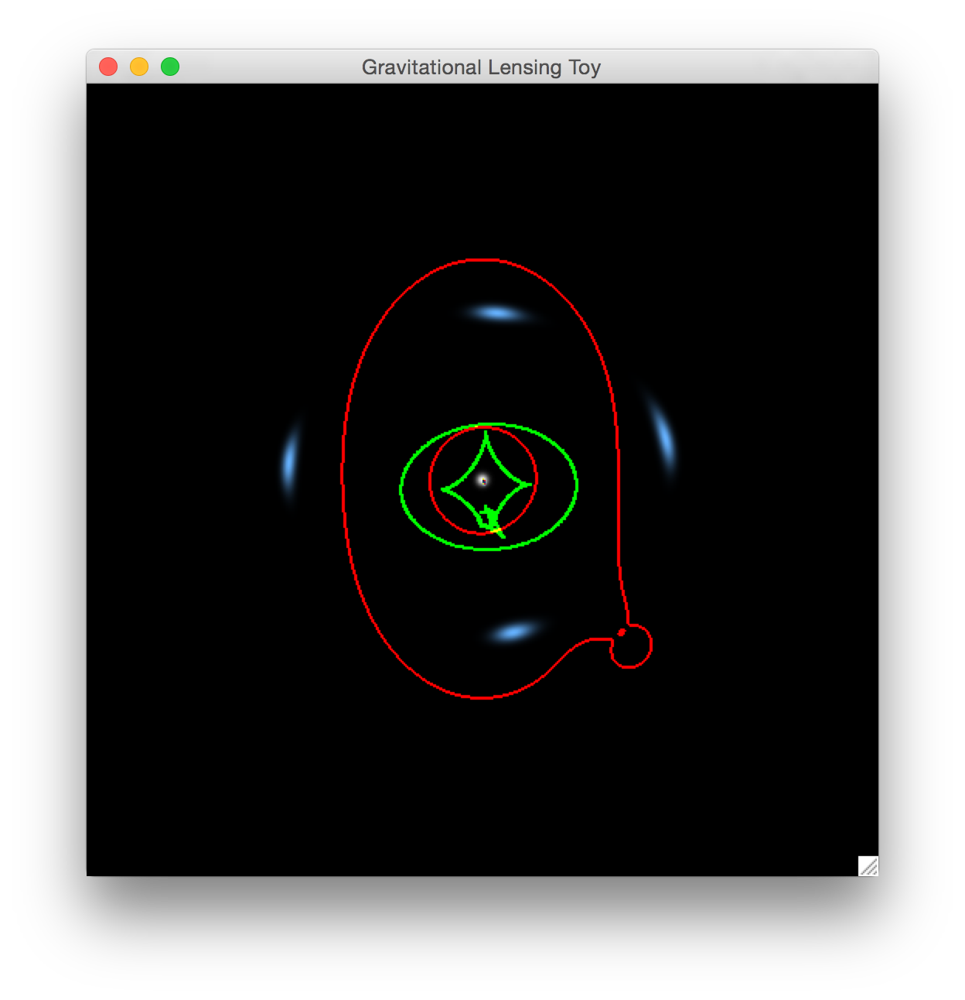
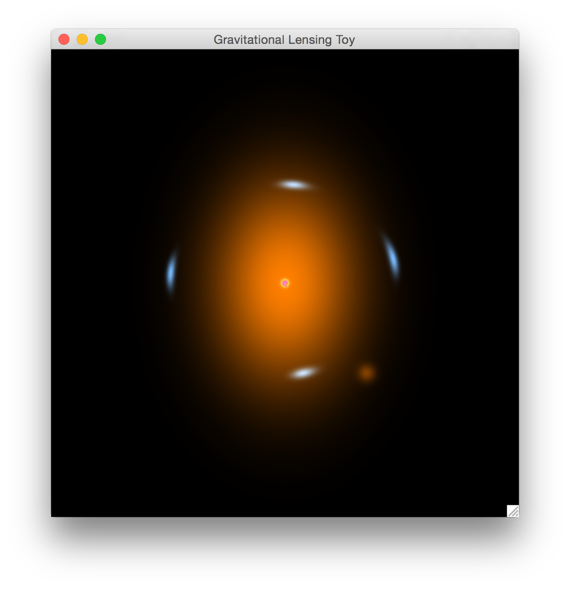
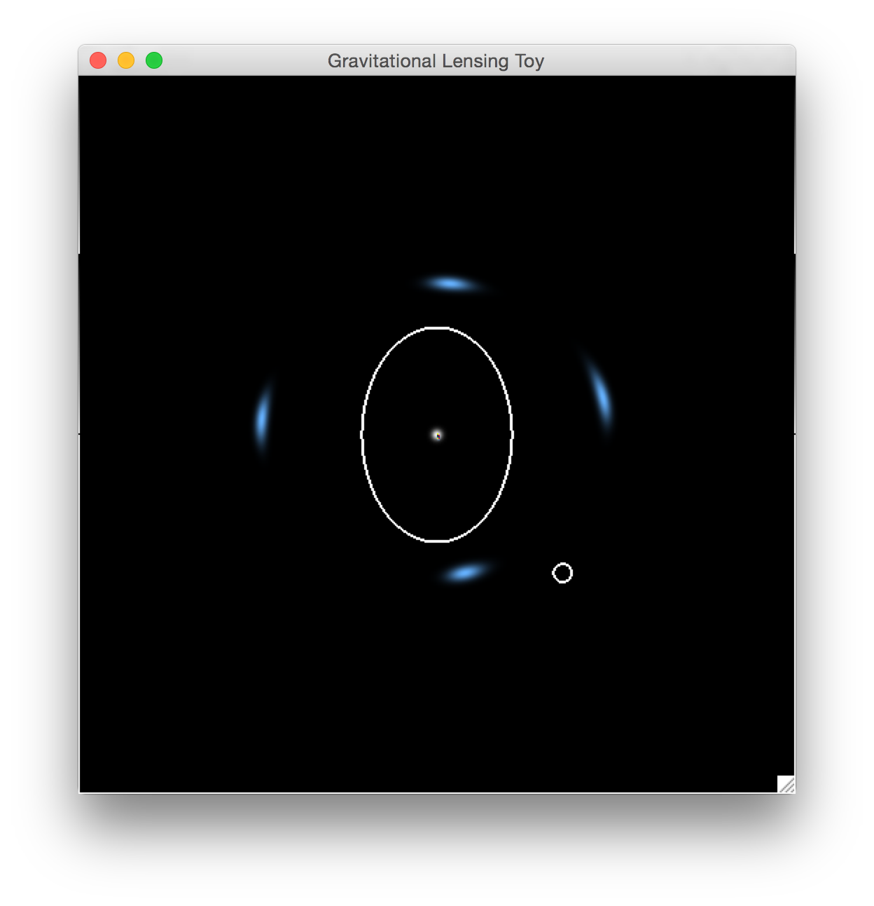

# Bending Light

## Introduction
Strong gravitational lensing is a remarkable phenomenon that produces some of the most striking images ever recorded by telescopes. The software tools that you can download here visually demonstrate what gravitational lensing is. By using a combination of mouse and keystrokes, you can build and explore a wide range of strong lensing scenarios. Extensive control of both the background sources and foreground lenses is offered. The software visualizes both the background sources and their strongly lensed images. Moreover, the caustic and critical curves of the lensing system are shown by default (Figure 1). The tool can visualize the properties of lenses (Figure 2), and the simulated observation of the lensing system (Figure 3).


Figure 1:

Figure 2:  

Figure 3:



## Installation
1. Dependences:  
	* [Python2.7](https://www.python.org), [Numpy](http://www.numpy.org), [Pygame](http://www.pygame.org), [Cython](http://cython.github.io) and [SDL](https://www.libsdl.org).
	* If you are using Linux, you can install all these packages using the default package manager, for example, apt-get for Debian and Ubuntu, yum for Fedora and Redhat,  pacman for Archlinux and so on.
	* If you are using Mac, I would recommend [Macports](https://www.macports.org) or [Homebrew](http://brew.sh) to install these packages.
	* My favorite way to install all the dependences is using [Anaconda](https://store.continuum.io/cshop/anaconda/). Once you installed Anaconda, the environment of python2.7 is ready.

	THEN

	```bash
	$ conda install -c https://conda.binstar.org/quasiben pygame
	```
	If your SDL is not installed in /usr/local/lib, you need to link it to the default directory.
	```bash
	$ sudo ln /opt/local/lib/libSDL-1.2.0.dylib /usr/local/lib/libSDL-1.2.0.dylib
	```
	* I have got the first version of a standalone APP for Mac using [py2app](http://pythonhosted.org/py2app/). You can find it here: [Lensing Toy](https://www.dropbox.com/s/uuaf13nfcoet44c/Lensing%20Toy.zip?dl=0).
	

2. Installation:  
	* Clone it or download it,    

	THEN
	```bash
	$ cd libs
	$ python2.7 setup.py build_ext --inplace
	```
	OR
	```bash
	$ cd libs
	$ ./make_so
	```
3. Code Running:  

	```bash
	$ cd ../
	$ python2.7 multiple_sources.py
	```


## Usage

1. Sources:
Sources are represented as 2D Gaussian distributions, and can be altered in size, shape, orientation, and placement. Multiple sources can also be placed (up to 9). Sources are controlled with the left mouse button, with a number key (1-9) to select the particular source. Here, "1" stands for the first source enabled by default, "2-9" stand for additional sources that may be added. The control details are listed below: as an example, to move the position of source 1, click and hold "1" and "w" and click the left mouse key to drag and place that source.

	* Hold the NUM key to pick the source you want to manipulate.
	* Hold "w" and the left mouse button to move the position of the source.
	* Hold "s" and the left mouse button and move the mouse vertically to change the size of the source.
	* Hold "e" and the left mouse button and move the mouse vertically to change the ellipticity of the source, or move the mouse horizontally to change the orientation of the source.
	* To add a new source (up to 9 total) hold "=" and left mouse click at the desired source location.

2. Lenses:
Lenses are modeled as non-singular isothermal ellipsoids (NIEs). For simplicity, lenses are visualized as 2D Gaussian light distributions. Lenses can be altered in "size" (see below), projected shape, orientation, and placement. Like sources, up to 9 lenses may be placed, and individually controlled. Lenses are controlled using the right mouse button, rather than the left as for sources. Controls are identical, except for the "size" control. Because we are using an NIE model in this code, when you press "s" to change the size of the lens, there are two sizes: one is the Einstein radius (move the mouse vertically), the other one is the core radius (move the mouse horizontally).

3. Visualization Toggles:
Try "f" and "g". :-)

## Todo List
1. Sources
 - [x] More sources.
 - [x] More models of sources (Sersic, Moffat, Disk\+Bulge...).
 - [x] Real galaxies images.
 - [x] Arbitrary pictures (for fun).

2. Lenses
 - [x] More models of lenses (PIEMD, GNFW, NFW\+Hernquist, Burkert...).
 - [x] Directly input mass sheet.
 - [x] More satellite galaxies?
 - [ ] Realistic images of satellite galaxies.

3. Algorithm 
 - [ ] Anti-Aliasing.
 - [ ] Better caustic drawer.

4. Time Delays
 - [x] Implement full time delay calculations, useful for varying sources.
 - [x] Animate varying sources, with time delays, in output visualizations.

5. Competitive Lensing - Modeling and Reconstruction!
 - [ ] Input lensed images by one person.
 - [ ] Reconstruct it by a second person.
 - [ ] Score the match.

6. Inputs and Outputs
 - [ ] Save the parameters of current lensing system, including lenses and sources, in multiple formats.
 - [ ] Input the system configuration - lenses and sources - as a catalog control file.
 - [ ] Show all the parameters of current lensing system in real time.
