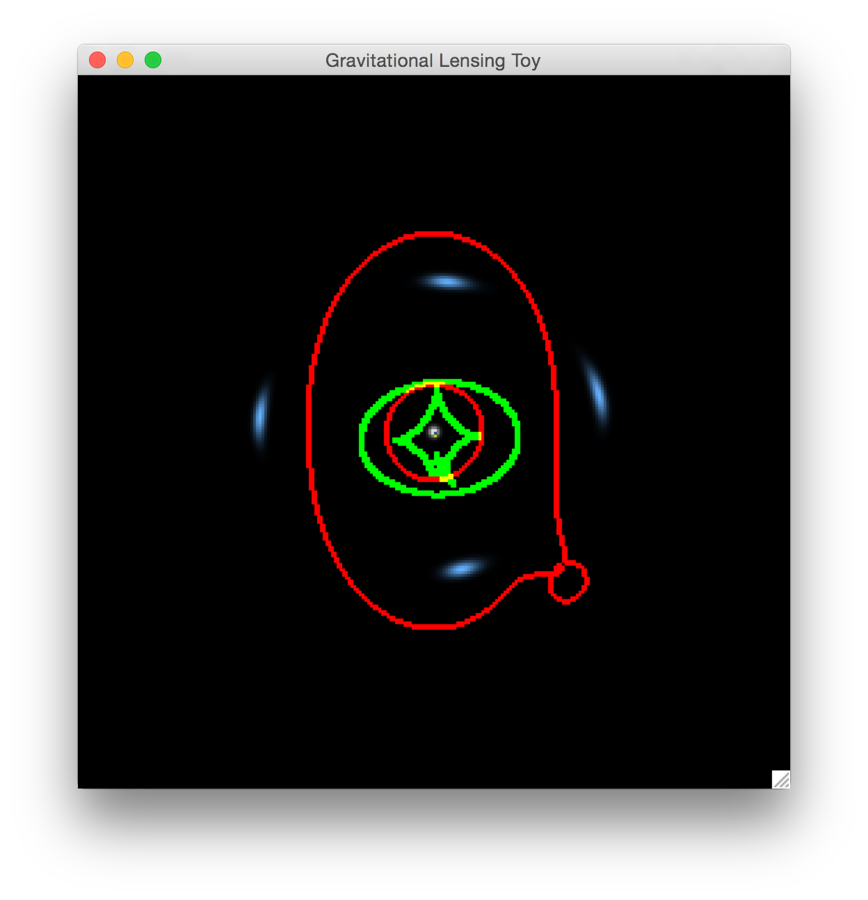
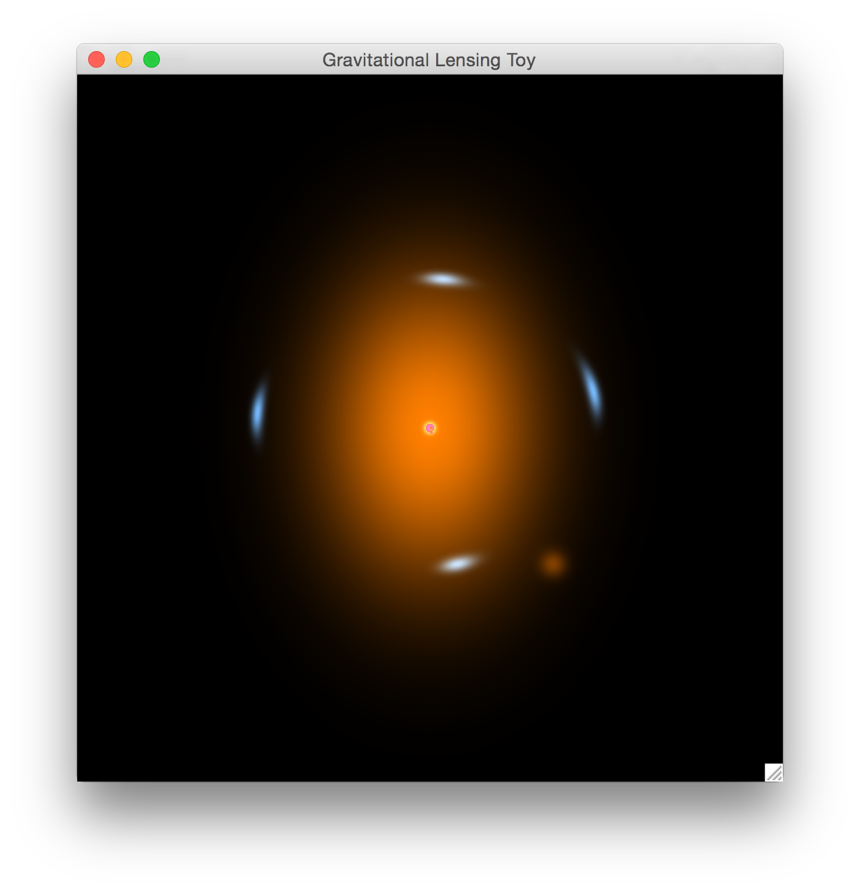
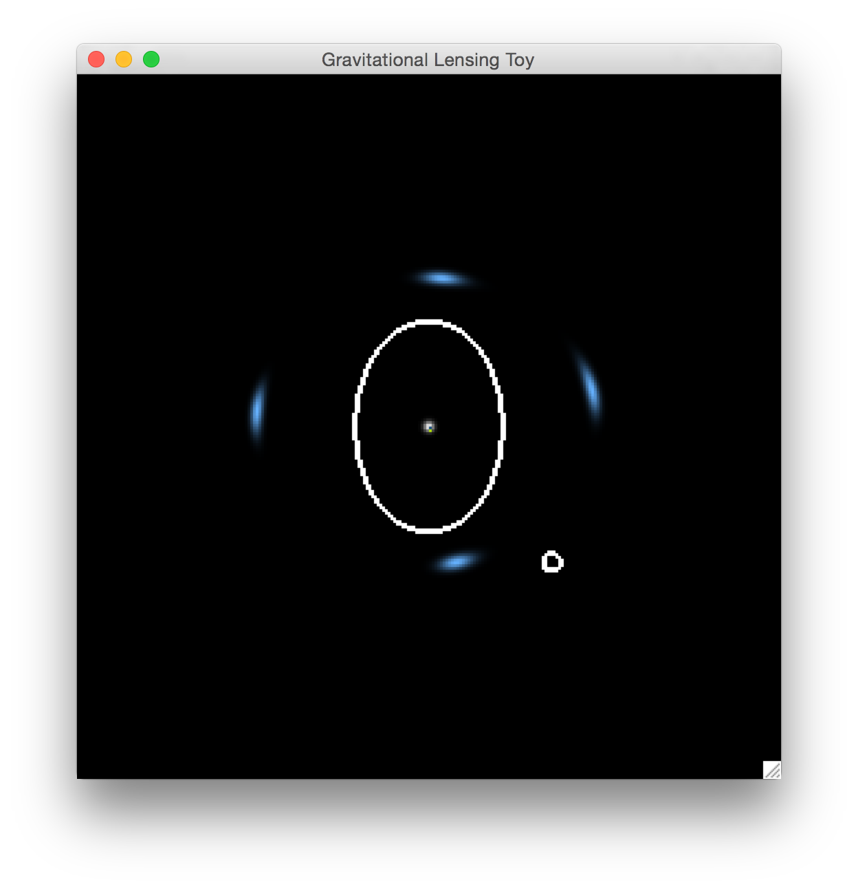

# cython_pylensing_toys

## Introduction
This is an improved version of my **_Glensing Toy_** with cython boosting. **_Glensing Toy_** is a software to demostrate what gravitational lensing is. By using some combinations of mouse and keys, you can control sources and lenses. **_Glensing Toy_** shows both sources (white balls) and lensed images (blue arcs). Moreover, caustic and critical curves of this lensing system are shown defaultly (Figure 1). By pressing "f" or "g", you can also take a look at the properties of lenses (Figure 3), and the simulated observation of the lensing system (Figure 2). 


Figure 1:

Figure 2:  

Figure 3:



1. Dependences:  
	* [Python2.7](https://www.python.org), [Numpy](http://www.numpy.org), [Pygame](http://www.pygame.org), [Cython](http://cython.github.io).

2. Installation:  
	* Clone it or download it,    

	THEN
	```bash
	$ python2.7 setup.py build_ext --inplace
	```
	OR
	```bash
	$./make_so
	```
3. Code Running:  

	```bash
	$ python2.7 multiple_sources.py
	```


##Usage

1. How to control sources:  
You can use the left click of the mouse to control the sources, but first of all, you need to hold one NUM key to choose a source you want to handle. Here, "1" stands for the first source, "2~9" stand for the added sources. Defaultly, one source is hown. Furthermore,  bullets below show the details on controling the source you pick.
  * Holding a NUM key to pick a source you want to play with. 
  * Holding "w" and left click, you can move you mouse to move the position of the source.
  * Holding "s" and left click, you can move you mouse vertically to change the size of the source.
  * Holding "e" and left click, you can move you mouse vertically to change the ellipticity of the source, or, horizontally to change the orientation of the source.

2. How to control lenses:  
You can use the right click of the mouse to control the lenses.
Similar with the source, at the same time, you need to press on number key to claim which component you want to control (Here, "1" stands for the main halo, "2~9" stand for the sub halos. ) and  press one key to claim what properties you would like to change. For example, if you want to change the ellipticity and orientation of the main halo: please hold "1", "e" and right click, then move vertically, the ellipticity of the main halo will be changed, move horizontally, the orientation of the main halo will be changed. Because we are using Non-singular Isothermal Ellipsoid (NIE) model in this code, so when you press "s" to change the size of the lens, there are two sizes, one is the Einstein Radius (move your mouse vertically), the other one is the core radius (move your mouse horizontally). If you want to control the subhalos, please hold "2" first, then do everything you want.  
  * Holding a NUM key to pick a component you want to play with. 
  * Holding "w" and right click, you can move you mouse to move the position of the chosen component of the lens.
  * Holding "s" and right click, you can move you mouse vertically to change the Einstein radius of chosen component, or, horizontally to change the Core radius of the chosen component.
  * Holding "e" and right click, you can move you mouse vertically  to change the ellipticity of the chosen component, or, horizontally to change the orientation of the chosen component.

3. How to add or remove satellite galaxies and sources: 
There is only one subhalo intrinsically. However, in our code, we can also add or remove subhalos if needed. So far, you can only add 8 subhalos at most.  
  * Hold "=", click the right click to add.
  * Hold "-", click the right click to remove the last added subhalo. 
  

Similarly, you can also control the number of sources
  * Hold "=", click the left click to add.
  * Hold "-", click the left click to remove the last added source.

4. Toggles:  
Try "f" and "g". :-)

##Todo List
1. Sources
 - [x] More sources.
 - [ ] More models of sources (Sersic, Moffat, Disk\+Bulge...).
 - [ ] Real galaxies images.
 - [ ] Arbitrary pictures (for fun).

2. Lenses
 - [ ] More models of lenses (PIEMD, GNFW, NFW\+Hernquist, Burkert...).
 - [ ] Directly input mass sheet.
 - [ ] More satellite galaxies?
 - [ ] Realistic images of satellite galaxies.

3. Algorithm 
 - [ ] Anti-Aliasing.
 - [ ] Better caustic drawer.

5. Time Delay
 - [x] Implementing in twinkles branch.

6. Competition Model
 - [ ] Input lensed images by one person.
 - [ ] Reconstruct it by another one.
 - [ ] Score the matching.

7. Input and Output
 - [ ] Save the parameters of current lensing system, including lenses and sources.
 - [ ] Make the catalog of lensing system to be an input file.
 - [ ] Show all the parameters of current lensing system in real time.
